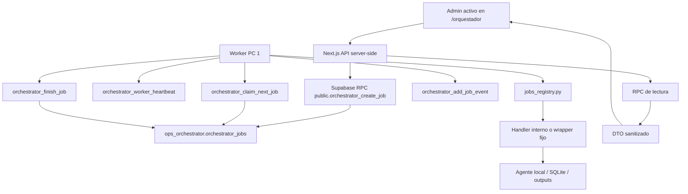

# Contexto maestro: orquestador, web y agentes McParking

Fecha de consolidacion: 2026-07-28

Este documento unifica el contexto operativo del PC 1 y el contexto web del PC 2 para continuar la migracion controlada del orquestador hacia la nueva web Gobierno Operativo.

## 1. Proposito

Dejar una fuente maestra para futuros chats, futuros Codex y mantencion operativa del flujo:

```text
Usuario admin
  -> Nueva web en Vercel
  -> Endpoint dedicado server-side
  -> RPC orchestrator_create_job
  -> Supabase ops_orchestrator
  -> Worker PC 1
  -> Registry local
  -> Wrapper fijo
  -> Agente local
  -> SQLite / outputs / proceso existente
  -> result + eventos en Supabase
  -> polling web
  -> resultado sanitizado
```

## 2. Alcance

Incluye la arquitectura fisica, contratos de jobs, estados, RPC, worker local, web `/orquestador`, controles ya migrados, barreras, riesgos y procedimientos para agregar nuevos agentes.

No incluye secretos, valores de `.env`, credenciales, DSN, tokens, datos personales, hosts sensibles ni ejecuciones reales.

## 3. Fuentes utilizadas y commits

Fuentes:

- Documento PC 1 adjunto: `contexto_pc1_worker_y_agentes.md`.
- Documento PC 2 existente: `docs/contexto_pc2_web_orquestador.md`.
- Estado local de la web al crear este documento.

Commits de referencia:

| Origen | Commit | Nota |
| --- | --- | --- |
| PC 1 orquestador funcional | `7f76ef2 Add Agent 01 execution lock` | HEAD funcional del PC 1 al momento de la auditoria original |
| PC 1 Agente 02 endurecido | `89ee185 Harden Agent 02 job execution` | Commit funcional de referencia del endurecimiento de payload y lock de Agente 02 |
| PC 1 contexto | `2de0d14 Document PC1 worker and agents context` | Commit que versiono el documento de contexto PC 1 |
| PC 1 plataforma funcional | `2ae8b60 Expand controlled sample for missing relation cases` | HEAD funcional de plataforma observado en la auditoria original |
| PC 2 web funcional | `a091de2 Add real last-week reservation update control` | Commit funcional de PC 2 con Banco de Reservas last-week |
| PC 2 Banco de Packs dry-run UI | `95f633a Show Banco de Packs dry-run result` | Commit funcional que corrige visualizacion del resultado dry-run de Banco de Packs |
| PC 2 contexto web | `0fdaf58 Document PC2 orchestrator web context` | Commit que versiono el documento de contexto PC 2 |

## 4. Arquitectura fisica completa

PC 2 contiene la nueva web en `C:\Users\McParking\Documents\red de roles, procesos, areas y responsables`.

Vercel aloja el proyecto `mcparking-gobierno-operativo`, con dominio publico `https://mcparking-gobierno-operativo.vercel.app`.

Supabase mantiene el schema `ops_orchestrator` como cola y bitacora compartida.

PC 1 contiene el worker local en `D:\mcparking-orquestador\worker_local` y los agentes en `D:\mcparking-platform`.

Durante la migracion y validacion gradual, el proyecto antiguo de Vercel `mcparking-orquestador` debe permanecer intacto como referencia/respaldo, salvo una decision futura explicita.

## 5. Diagrama maestro



## 6. Principio arquitectonico

Vercel no llama al PC 1, no abre puertos locales y no ejecuta agentes. La web solo crea jobs cerrados en Supabase y consulta estados sanitizados. El worker del PC 1 consulta Supabase desde dentro de la red autorizada y decide, con registry y barreras locales, si puede ejecutar.

## 7. Responsabilidades de PC 1

- Ejecutar `worker_local/worker.py`.
- Registrar heartbeat y estado del worker.
- Reclamar jobs elegibles desde Supabase.
- Validar job type y payload en `worker_local/jobs_registry.py`.
- Ejecutar handlers internos o wrappers fijos.
- Mantener locks operacionales.
- Reportar eventos, resultado y errores controlados.
- Acceder a fuentes restringidas solo desde el entorno autorizado.

## 8. Responsabilidades de PC 2

- Implementar UI y API server-side de `/orquestador`.
- Validar admin activo antes de leer o crear jobs.
- Crear solo jobs con contrato cerrado server-side.
- No aceptar comandos, payloads operacionales libres ni targets arbitrarios.
- Mostrar solo DTO seguros y resultados sanitizados.
- Hacer polling por ID exacto del job creado.

## 9. Responsabilidades de Vercel

- Alojar la aplicacion Next.js del proyecto `mcparking-gobierno-operativo`.
- Ejecutar endpoints server-side con variables seguras.
- No tener acceso a discos ni procesos del PC 1.
- No ejecutar workers, wrappers, agentes ni comandos locales.

## 10. Responsabilidades de Supabase

- Mantener cola, workers, eventos, job types y resultados.
- Exponer RPC publicas controladas para web y worker.
- Aplicar atomicidad en claim y finalizacion.
- Ser puente entre Vercel y PC 1, no motor de ejecucion local.

## 11. Contrato completo de un job

Columnas relevantes confirmadas en `ops_orchestrator.orchestrator_jobs`:

- `id`, `job_type`, `status`, `requested_by`, `requested_source`.
- `target_worker_id`, `locked_by_worker_id`, `priority`.
- `payload`, `result`, `error_message`.
- `attempts`, `max_attempts`, `not_before`.
- `started_at`, `finished_at`, `last_heartbeat_at`.
- `created_at`, `updated_at`.

En la web, `payload`, `result` y `error_message` nunca deben exponerse crudos.

## 12. Estados del job y worker

Estados persistidos de job confirmados por PC 1:

```text
queued, running, succeeded, failed, cancelled
```

Estados de worker confirmados:

```text
offline, idle, busy, error
```

Diferencia conocida: PC 2 incluye `claimed` como estado activo defensivo. PC 1 confirma que la RPC de claim mueve directamente de `queued` a `running`; `claimed` aparece como evento, no como estado persistido confirmado.

## 13. Flujo completo desde boton hasta resultado

1. Admin activo presiona un control dedicado.
2. La UI envia una solicitud minima al endpoint especifico.
3. El endpoint valida sesion y admin activo.
4. El endpoint rechaza query params y body no permitido.
5. El endpoint fija job type, payload, source, target y priority en servidor.
6. Supabase crea el job `queued` y evento `created`.
7. Worker PC 1 hace heartbeat y claim.
8. Supabase marca el job `running`, incrementa `attempts`, asigna `locked_by_worker_id` y `current_job_id`.
9. Worker valida el payload en registry.
10. Worker ejecuta handler interno o wrapper fijo segun barreras.
11. Worker finaliza con `succeeded`, `failed` o `cancelled`.
12. La web consulta por ID y muestra DTO seguro.

## 14. Worker local

Archivo principal: `worker_local/worker.py`.

Funciones relevantes:

- `main()`: configura, registra worker y entra al loop.
- `run_loop()`: itera y maneja errores globales.
- `run_once()`: heartbeat `idle`, claim y dispatch.
- `handle_job()`: valida tipo/payload y deriva a handler o comando.
- `reject_job()`: falla jobs invalidos o no permitidos.

Configuracion operativa confirmada:

- `WORKER_ID`, default `pc_operaciones_01`.
- `WORKER_DISPLAY_NAME`, default `PC Operaciones 01`.
- `WORKER_POLL_INTERVAL_SECONDS`, default `10`.
- `WORKER_DRY_RUN`, default `true`.
- `WORKER_ALLOW_REAL_EXECUTION`, default `false`.
- `COMMAND_TIMEOUT_SECONDS`, default `3600`.

## 15. Registry y payloads

Fuente PC 1: `worker_local/jobs_registry.py`.

| Job type | Payload permitido | Ejecucion |
| --- | --- | --- |
| `worker_health_check` | `{}` exacto | Handler interno, sin comandos |
| `source_connection_check` | `{}` exacto | Handler interno, read-only, `SELECT 1` |
| `banco_reservas_actualizar` | `modo` permitido y `confirmar_borrado` solo para rebuild | Wrapper Agente 01 |
| `banco_packs_actualizar_sin_consumos` | `{ "action": "actualizar-packs" }` exacto | Wrapper Agente 02 |
| `banco_packs_actualizar_completo` | `action` en allowlist con confirmacion exacta segun action | Wrapper Agente 02 |
| `dashboard_actualizar_metricas` | `agent='dashboard'` y periodo permitido | Handler interno |
| `banco_personas_placeholder` | No implementado | Deshabilitado localmente |

Payloads estrictos de Packs confirmados desde PC 1 en `89ee185 Harden Agent 02 job execution`.

Contratos exactos:

```json
{ "action": "actualizar-packs" }
```

```json
{ "action": "actualizar-consumos", "confirmar_actualizacion_consumos": true }
```

```json
{ "action": "actualizar-saldos", "confirmar_actualizacion_saldos": true }
```

```json
{ "action": "actualizar-packs-consumos-saldos", "confirmar_actualizacion_completa": true }
```

```json
{ "action": "rebuild-completo-operativo", "confirmar_borrado_total": true }
```

Se rechazan claves extra, confirmaciones ausentes, falsas o cruzadas, actions desconocidas y payload no objeto. Reservas tiene contrato estricto contra claves extra. Health y source check aceptan solo payload vacio.

## 16. Wrappers

Los jobs operacionales no ejecutan comandos libres. El registry produce comandos fijos hacia wrappers conocidos.

Agente 01 usa:

- `D:\mcparking-orquestador\scripts\agente_01_banco_reservas.ps1`.
- Agente real: `D:\mcparking-platform\agentes\agente_01_banco_reservas\cli.py`.

Agente 02 usa:

- `D:\mcparking-orquestador\scripts\agente_02_banco_packs.ps1`.
- Agente real: `D:\mcparking-platform\agentes\agente_02_banco_packs\cli.py`.

## 17. Locks y concurrencia

Agente 01 tiene lock operacional:

- Archivo: `D:\mcparking-orquestador\runtime\locks\agente_01_banco_reservas.lock`.
- Implementacion: archivo abierto con exclusividad.
- Lock ocupado devuelve exit code `73` y mensaje controlado.

El lock protege ejecuciones via wrapper del orquestador. No protege ejecuciones manuales directas en `D:\mcparking-platform`.

Agente 02 ahora tiene lock operacional confirmado desde PC 1 en `89ee185 Harden Agent 02 job execution`.

- Script: `scripts/agente_02_lock.ps1`.
- Archivo: `runtime/locks/agente_02_banco_packs.lock`.
- Exclusividad: `FileShare.None`.
- Exit code ocupado: `74`.
- Mensaje: `Agente 02 ya tiene una ejecución en curso.`
- Aplica a todas las acciones del Agente 02.
- Alcance parcial: no protege ejecucion manual directa en `D:\mcparking-platform`.

## 18. Barreras de dry-run y ejecucion real

Valores seguros por defecto del PC 1:

```text
WORKER_DRY_RUN=true
WORKER_ALLOW_REAL_EXECUTION=false
ORCHESTRATOR_ALLOW_AGENT01_REAL_EXECUTION=false
ORCHESTRATOR_ALLOW_AGENT02_REAL_EXECUTION=false
```

Para ejecucion real controlada se abren barreras solo en la sesion del worker y por el minimo tiempo necesario. No debe quedar configuracion permanente con ejecucion real abierta.

## 19. Supabase: tablas, RPC y eventos

Tablas principales:

- `ops_orchestrator.orchestrator_job_types`
- `ops_orchestrator.orchestrator_workers`
- `ops_orchestrator.orchestrator_jobs`
- `ops_orchestrator.orchestrator_job_events`

RPC usadas por PC 1:

- `orchestrator_register_worker`
- `orchestrator_worker_heartbeat`
- `orchestrator_claim_next_job`
- `orchestrator_finish_job`
- `orchestrator_add_job_event`
- `orchestrator_recover_stuck_worker`

RPC usadas por PC 2:

- `orchestrator_list_workers`
- `orchestrator_list_job_types`
- `orchestrator_list_jobs`
- `orchestrator_list_events`
- `orchestrator_create_job`

Eventos confirmados por las fuentes consolidadas:

- `created`
- `claimed`
- `worker_received`
- `worker_validated`
- `worker_dry_run`
- `worker_health_check`
- `source_connection_check`
- `worker_dashboard_started`
- `worker_dashboard_placeholder`
- `worker_dashboard_calculated`
- `worker_dashboard_written`
- `worker_rejected`
- `succeeded`
- `failed`
- `cancelled`

## 20. Nueva web `/orquestador`

Archivos principales:

- `src/app/orquestador/page.tsx`
- `src/app/orquestador/worker-health-check-button.tsx`
- `src/app/orquestador/source-connection-check-control.tsx`
- `src/app/orquestador/banco-reservas-last-week-control.tsx`
- `src/app/api/orquestador/*`
- `src/lib/orquestador/auth.ts`
- `src/lib/orquestador/supabase-admin.ts`
- `src/lib/orquestador/types.ts`
- `src/lib/orquestador/banco-reservas-last-week.ts`

La pantalla lista workers, jobs, eventos y job types. Los controles de ejecucion son independientes entre si.

## 21. Autenticacion y permisos

Regla real:

```text
app_role === "admin" AND status === "active"
```

La pagina usa validacion server-side. Las API usan `getActiveAdminUser()` y no dependen solo de ocultar menu.

## 22. DTO y sanitizacion

La web expone DTO seguros:

- Workers: identidad, display, estado, heartbeat y job actual.
- Jobs: id, tipo, estado, worker, tiempos, attempts y error resumido.
- Eventos: id, job, worker, tipo, mensaje seguro y fecha.
- Job types: tipo, nombre, descripcion y enabled.

No se devuelve crudo:

- `payload`
- `result`
- `metadata`
- `data`
- comandos
- stdout/stderr
- rutas locales
- stack traces

Resultados seguros conocidos:

- `worker_health_check`: `ok`, `worker_id`, `checked_at`, `dry_run`, `real_execution_allowed`.
- `source_connection_check`: `ok`, `source_key`, `checked_at`, `duration_ms`, `read_only`, `worker_id`.
- `banco_reservas_actualizar`: `ok`, `duration_seconds`, `modo`, `returncode`, `timed_out`.
- `banco_packs_actualizar_sin_consumos`: `ok`, `duration_seconds`, `action`, `returncode`, `timed_out`.

## 23. Readiness, heartbeat y cola

Para Banco de Reservas last-week, la web valida:

- job type existe y `enabled=true`.
- worker `pc_operaciones_01` existe.
- worker `status=idle`.
- `current_job_id`/`locked_job_id` es null.
- `last_seen_at` tiene maximo 120 segundos.
- no hay jobs globales activos en `queued`, `claimed` o `running`.

La comprobacion se repite inmediatamente antes de crear el job.

## 24. Polling

Los controles web hacen polling aislado por ID exacto del job creado. Usan `AbortController`, evitan doble envio, se detienen al desmontar o al llegar a estado terminal, y pausan cuando la pestana no esta visible. Un timeout visual no cancela el job ni modifica Supabase.

## 25. Controles ya migrados

Controles existentes en la nueva web:

- `worker_health_check`: puente seguro Web -> Supabase -> Worker -> Supabase.
- `source_connection_check`: conectividad read-only desde PC 1.
- `banco_reservas_actualizar` modo `last-week`: ejecucion real controlada de Agente 01.
- `banco_packs_actualizar_sin_consumos` accion `actualizar-packs`: control web implementado, desplegado y validado E2E en dry-run.
- `dashboard_actualizar_metricas` periodo `last-month`: control web individual implementado localmente; dry-run web y ejecucion real pendientes.
- `actualizar_datos_operacionales_last_month`: UI compuesta integrada localmente en PC 2; usa endpoints server-side existentes y `CompositeRunViewer`; dry-run web, validacion web real, deploy y ejecucion real pendientes.

Cada control tiene endpoint dedicado. No existe endpoint generico para ejecutar comandos desde la web nueva.

## 26. Banco de Reservas

Job type: `banco_reservas_actualizar`.

Control web actual: ultima semana.

Contrato server-side:

```json
{
  "job_type": "banco_reservas_actualizar",
  "payload": { "modo": "last-week" },
  "requested_source": "web_orchestrator_last_week",
  "target_worker_id": "pc_operaciones_01",
  "priority": 1
}
```

El usuario solo confirma. No puede elegir modo, target, prioridad ni payload. No hay acceso a `rebuild` desde este control.

Nivel de evidencia de la prueba real: la ejecucion real `last-week` fue validada en el registro operativo del proyecto y en la sesion de prueba documentada. Este documento maestro no volvio a consultar Supabase, logs del worker ni SQLite; los documentos fuente de codigo describen el contrato, y la evidencia E2E proviene del registro operativo de la prueba.

Resultado registrado: `succeeded`, `attempts=1`, `returncode=0`, sin `rebuild` y sin Agente 02.

## 27. Banco de Packs / Agente 02

Job types conectados localmente:

- `banco_packs_actualizar_sin_consumos`
- `banco_packs_actualizar_completo`

Acciones registry:

- `actualizar-packs`
- `actualizar-consumos`
- `actualizar-saldos`
- `actualizar-packs-consumos-saldos`
- `rebuild-completo-operativo`

Estado actual: el endurecimiento PC 1 esta completado en `89ee185 Harden Agent 02 job execution`. Payload estricto y lock operacional ya estan confirmados. La integracion web para `actualizar-packs` esta implementada y desplegada en PC 2, con dry-run web E2E validado.

Primer control web implementado: `actualizar-packs` mediante `banco_packs_actualizar_sin_consumos`.

Contrato web PC 2:

- Endpoint: `POST /api/orquestador/banco-packs/actualizar-packs`.
- Body cliente: `{ "confirm": true }` exacto.
- Payload server-side: `{ action: "actualizar-packs" }`.
- requested_source: `web_orchestrator_banco_packs_actualizar_packs`.
- target_worker_id: `pc_operaciones_01`.
- priority: `1`.
- Readiness: job type enabled, worker idle con heartbeat <= 120 segundos, sin `current_job_id`, sin cola global activa.
- DTO seguro: `ok`, `dry_run`, `message`, `duration_seconds`, `action`, `returncode`, `timed_out`, contadores opcionales si existen.
- Polling: por ID exacto y job type esperado; timeout visual no cancela el job.
- Pruebas: `scripts/orquestador-banco-packs-actualizar-packs.test.mjs`.

Evidencia E2E dry-run desde web:

- Commit PC 2: `95f633a Show Banco de Packs dry-run result`.
- Job: `fcbc3229-8abf-48e7-a522-7b6fd1d07957`.
- Estado: `succeeded`.
- Attempts: `1`.
- Worker: `pc_operaciones_01`.
- Duracion aproximada visible: 5 segundos.
- Resultado visible: dry-run completado correctamente.
- Accion: `actualizar-packs`.
- Mensaje visible: `Dry-run: comando real no ejecutado.`.
- Barreras efectivas: `WORKER_DRY_RUN=true`, `WORKER_ALLOW_REAL_EXECUTION=false`, `ORCHESTRATOR_ALLOW_AGENT02_REAL_EXECUTION=false`.
- Estado final observado: worker idle, current job vacio, cola `0`, job historico `succeeded`, `attempts=1/1`.

Estado reclasificado: control implementado, desplegado, dry-run web E2E validado y listo para planificar prueba real controlada. No marcar ejecucion real como validada.

Aclaracion: el dry-run valido la arquitectura completa hasta UI, pero no ejecuto wrapper, lock, CLI ni datos reales.


## 28. Dashboard last-month

Control individual implementado localmente en PC 2 para el job existente `dashboard_actualizar_metricas`.

Contrato web PC 2:

- Endpoint: `POST /api/orquestador/dashboard/last-month`.
- Body cliente: `{ "confirm": true }` exacto.
- Payload server-side: `{ agent: "dashboard", action: "actualizar-metricas", periodo: "last-month" }`.
- requested_source: `web_orchestrator_dashboard_last_month`.
- target_worker_id: `pc_operaciones_01`.
- priority: `1`.
- Readiness: job type enabled, worker idle con heartbeat <= 120 segundos, sin `current_job_id`, sin cola global activa.
- DTO seguro: `ok`, `dry_run`, `message`, `duration_seconds`, `periodo`, `returncode`, `timed_out`, `rows_written`, `dates_processed` si existen.
- Polling: por ID exacto y job type esperado; timeout visual no cancela el job.
- Pruebas: `scripts/orquestador-dashboard-last-month.test.mjs`.

Este boton es individual: no ejecuta Reservas ni Packs, no acepta `agent`, `action`, `periodo`, `job_type`, target, prioridad, comandos, rutas ni payload libre desde el navegador.

Estado: implementacion local lista. Dry-run web y ejecucion real pendientes; boton compuesto integrado localmente.


## 28.1 CompositeRunViewer

PC 2 cuenta ahora con un componente local reutilizable para visualizar ejecuciones compuestas del orquestador.

| Campo | Estado |
| --- | --- |
| Componente | `src/app/orquestador/composite-run-viewer.tsx` |
| Tipos y mapeador seguro | `src/lib/orquestador/composite-runs.ts` |
| Pruebas locales | `scripts/orquestador-composite-run-viewer.test.mjs` |
| Primer consumidor previsto | `Actualizar datos operacionales` |
| Supabase real | No llamado por el viewer ni por el mapper |
| Jobs | No crea jobs ni ejecuta POST |
| Estado | viewer local integrado al control compuesto; dry-run web pendiente; ejecucion real pendiente |

El viewer recibe un `CompositeRunViewModel` por props y no inicia ejecuciones. El mapeador trabaja con filas seguras de lectura de composite runs, sin `payload` ni `result` crudos, ordena etapas por `sequence_index`, crea placeholders para pasos faltantes, calcula estado/progreso/duracion y reutiliza sanitizacion operacional para textos visibles.


### Endpoints compuestos `Actualizar datos operacionales`

PC 2 tiene endpoints locales server-side para iniciar, avanzar y consultar el run compuesto `actualizar_datos_operacionales_last_month`. Estos endpoints usan las RPC `orchestrator_create_composite_job_step` y `orchestrator_list_composite_run_jobs`; no llaman wrappers ni agentes y no aceptan payload operacional libre desde el navegador.

| Etapa | Job type | Payload server-side | requested_source | priority |
| ---: | --- | --- | --- | ---: |
| 1 | `banco_reservas_actualizar` | `{ "modo": "last-month" }` | `web_orchestrator_operaciones_last_month_reservas` | 90 |
| 2 | `banco_packs_actualizar_sin_consumos` | `{ "action": "actualizar-packs" }` | `web_orchestrator_operaciones_last_month_packs` | 91 |
| 3 | `dashboard_actualizar_metricas` | `{ "agent": "dashboard", "action": "actualizar-metricas", "periodo": "last-month" }` | `web_orchestrator_operaciones_last_month_dashboard` | 92 |

El inicio crea solo etapa 1 con `composite_run_id` generado server-side. El avance lista el run, valida `composite_kind`, espera que la etapa actual termine en `succeeded` y crea solo la etapa siguiente. Las guardas revisan los tres job types, `enabled=true`, worker `pc_operaciones_01`, heartbeat reciente, worker idle, `locked_job_id` vacio y ausencia de cola global activa. El GET devuelve `CompositeRunViewModel` seguro.

UI compuesta PC 2:

- Control: `src/app/orquestador/actualizar-datos-operacionales-control.tsx`.
- Hook: `src/app/orquestador/use-composite-operations-run.ts`.
- Test estatico: `scripts/orquestador-actualizar-datos-ui.test.mjs`.
- Modal accesible de confirmacion antes de iniciar.
- Inicio: cliente envia solo `{ "confirm": true }`.
- Avance automatico: cliente envia solo `{ "run_id": "<uuid>" }`; no envia etapa, job type, payload, prioridad, source ni target.
- Persistencia: solo `run_id` en `localStorage` con clave `orquestador:actualizar-datos:last-month:run-id:v1`.
- Polling: GET por `run_id`, `AbortController`, sin requests superpuestos, pausa con pestana oculta y detencion en estados terminales.
- `Cerrar resultado` solo limpia UI/localStorage; no cancela jobs.

Estado: endpoints locales listos; UI compuesta integrada localmente con `CompositeRunViewer`; dry-run web, validacion web real, deploy y ejecucion real pendientes.

## 29. Agente 03 y futuros agentes

Agente 03 Banco de Personas existe en plataforma, con SQLite local y comandos de diagnostico/lectura. El worker solo tiene `banco_personas_placeholder`, deshabilitado y sin comando operativo. Agente 03 v2 es desarrollo paralelo para relaciones e identidades tecnicas y no debe conectarse al worker sin etapa separada.

## 30. Patron para replicar un boton

1. Definir un unico caso de uso.
2. Confirmar job type y payload en PC 1.
3. Confirmar migracion/job type en Supabase con `enabled=false` inicial.
4. Validar dry-run.
5. Abrir barreras de forma temporal para prueba real si corresponde.
6. Crear endpoint dedicado en PC 2.
7. Fijar server-side job type, payload, source, target y priority.
8. Rechazar query params y body no esperado.
9. Validar admin activo.
10. Validar readiness justo antes de crear.
11. Devolver DTO seguro.
12. Crear UI con confirmacion, doble-click guard y polling aislado.

## 31. Procedimiento para integrar un agente nuevo

PC 1 primero:

- wrapper fijo.
- registry con payload estricto.
- barreras runtime.
- lock si escribe archivos o bases.
- pruebas unitarias de payload/comando.
- job type en Supabase deshabilitado.

PC 2 despues:

- endpoint dedicado.
- DTO seguro.
- readiness especifica.
- control UI sin parametros libres.
- pruebas estaticas del contrato.

## 32. Checklist PC 1

- Worker corre con ID esperado.
- Heartbeat visible.
- Job type existe localmente.
- Payload estricto probado.
- Wrapper fijo existe.
- Barreras seguras por defecto.
- Lock definido si hay escritura local.
- Timeout definido.
- Resultado no contiene secretos.

## 33. Checklist PC 2

- Pagina y API son admin-only.
- Endpoint dedicado.
- Sin command/action/args libres.
- Sin payload libre desde navegador.
- Body y query params rechazados si no corresponden.
- DTO sanitizado.
- Polling por ID exacto.
- No usa endpoint antiguo generico.
- No toca `/recuperacion`.

## 34. Checklist Supabase

- Job type registrado.
- `enabled=false` hasta validacion.
- RPC existentes usadas sin inventar firmas.
- Eventos visibles.
- Cola sin jobs activos antes de pruebas reales.
- Recuperacion disponible solo por procedimiento controlado.

## 35. Checklist de prueba dry-run

- Mantener barreras reales cerradas.
- Crear job unico y controlado.
- Confirmar claim.
- Confirmar eventos.
- Confirmar resultado sanitizado.
- Confirmar que no se ejecuto subprocess si el job es handler interno o que el wrapper real no se ejecuto si el job es dry-run operativo.
- Confirmar cola final.
- Confirmar que la UI muestra el DTO seguro y no expone payload/result crudo, stdout, stderr ni `command_preview`.

## 36. Checklist de prueba real

- Probar una accion de bajo impacto.
- Abrir barreras solo en sesion controlada.
- Verificar worker idle y heartbeat reciente.
- Verificar cola global vacia.
- Crear job desde la web.
- Monitorear eventos.
- Confirmar salida esperada.
- Cerrar barreras al terminar.
- Verificar cola final.

## 37. Rollback y recuperacion

Rollback web:

- deshabilitar control en UI o revertir commit de PC 2.

Rollback Supabase:

- poner job type en `enabled=false`.

Recuperacion worker:

- usar procedimiento controlado con `orchestrator_recover_stuck_worker`.
- no recuperar automaticamente sin revisar job, worker y eventos.

## 38. Que no debe modificarse

- Durante la migración gradual, no modificar ni reemplazar el proyecto antiguo `mcparking-orquestador` en Vercel sin una decisión futura explícita.
- `D:\mcparking-orquestador` desde tareas de la web PC 2.
- `D:\mcparking-platform` desde tareas de la web PC 2.
- `/recuperacion` salvo tarea explicita de recuperacion.
- Variables de entorno productivas sin autorizacion.
- Migraciones aplicadas manualmente desde Codex sin instruccion explicita.
- Comandos libres, payloads arbitrarios o endpoints genericos de ejecucion.

## 39. Riesgos y limitaciones

| Riesgo | Estado |
| --- | --- |
| Vercel no puede ejecutar procesos locales | Diseñado así; debe usar Supabase como puente |
| `claimed` en PC 2 no es estado persistido confirmado | Compatibilidad defensiva |
| Lock Agente 01 no es global | Protege wrapper del orquestador, no ejecucion manual directa |
| Lock Agente 02 parcial, no global | Protege wrapper del orquestador, no ejecucion manual directa desde plataforma |
| Ejecucion manual directa de Agente 02 puede evitar el lock | Requiere disciplina operacional fuera de PC 2 |
| Lock Agente 02 durante ejecucion real | Aun no ejercitado desde la nueva web porque el E2E validado fue dry-run |
| Rollback operacional real de Agente 02 | Pendiente de validar/documentar antes de ejecucion real |
| Integracion web de Agente 02 en dry-run | Validada E2E desde nueva web; falta prueba real controlada |
| Resultado seguro de Agente 02 | DTO de Packs soporta dry-run seguro; resultado real y contadores aun deben confirmarse |
| Dashboard last-month | Implementacion local lista; dry-run web y ejecucion real pendientes |
| Actualizar datos operacionales | UI compuesta integrada localmente; dry-run web, validacion web real, deploy y ejecucion real pendientes |
| Result Banco con `returncode=0` no garantiza semantica completa | Revisar resultado operacional |
| Worker no reanuda jobs running tras reinicio | Recuperacion manual controlada |

## 40. Diferencias de contrato conocidas

- PC 1 es canonico para estados persistidos: `queued`, `running`, `succeeded`, `failed`, `cancelled`.
- PC 2 incluye `claimed` como estado activo defensivo.
- PC 1 claim RPC pasa de `queued` a `running` y registra evento `claimed`.
- PC 2 convierte `current_job_id` del worker a `locked_job_id` para la UI.
- PC 2 consulta jobs con limites de UI y, para readiness de Banco, con limite amplio para detectar cola activa.

## 41. Preguntas abiertas

- Si se mantendra `claimed` como compatibilidad defensiva o se alineara estrictamente a estados persistidos.
- Cuando realizar prueba real controlada de `actualizar-packs` desde PC 2.
- Cuando realizar dry-run web de Dashboard last-month.
- Que campos reales devolvera Agente 02 despues de una ejecucion real.
- Como validar SQLite antes/despues de la prueba real.
- Como cerrar barreras inmediatamente despues de la prueba real.
- Si documentar un procedimiento operativo de rollback.
- Si el job type debe permanecer `enabled=true` durante pruebas o habilitarse solo por ventanas controladas.
- Si Agente 01 necesita lock global tambien dentro de `D:\mcparking-platform`.
- Cual linea de Agente 03 sera oficial: v1 o v2.
- Que job real sera el siguiente despues de Banco Reservas last-week.
## 41. Glosario

| Termino | Significado |
| --- | --- |
| PC 1 | Computador operativo con VPN, worker y agentes |
| PC 2 | Computador de desarrollo de la nueva web |
| Worker | Proceso local que consulta Supabase y ejecuta jobs permitidos |
| Registry | Allowlist local de job types, payloads y comandos |
| Wrapper | Script fijo que media entre worker y agente real |
| Dry-run | Modo sin ejecucion real de agente |
| Real execution | Ejecucion efectiva habilitada por barreras runtime |
| DTO seguro | Respuesta sanitizada apta para navegador |
| Lock operacional | Mecanismo para evitar ejecuciones simultaneas por wrapper |
| Heartbeat | Senal periodica del worker hacia Supabase |

## 43. Referencias cruzadas

PC 2 web:

- `docs/contexto_pc2_web_orquestador.md`
- `src/app/orquestador/page.tsx`
- `src/lib/orquestador/auth.ts`
- `src/lib/orquestador/supabase-admin.ts`
- `src/lib/orquestador/types.ts`
- `src/lib/orquestador/banco-reservas-last-week.ts`
- `src/app/api/orquestador/health-check/route.ts`
- `src/app/api/orquestador/source-connection-check/route.ts`
- `src/app/api/orquestador/banco-reservas/last-week/route.ts`

PC 1 orquestador:

- `worker_local/worker.py`
- `worker_local/config.py`
- `worker_local/supabase_client.py`
- `worker_local/jobs_registry.py`
- `worker_local/command_runner.py`
- `worker_local/health_check.py`
- `scripts/agente_01_banco_reservas.ps1`
- `scripts/agente_01_lock.ps1`
- `scripts/agente_02_banco_packs.ps1`

PC 1 plataforma:

- `agentes/agente_01_banco_reservas/cli.py`
- `agentes/agente_02_banco_packs/cli.py`
- `agentes/agente_03_banco_personas/cli.py`
- `agentes/agente_03_banco_personas_v2/cli.py`
