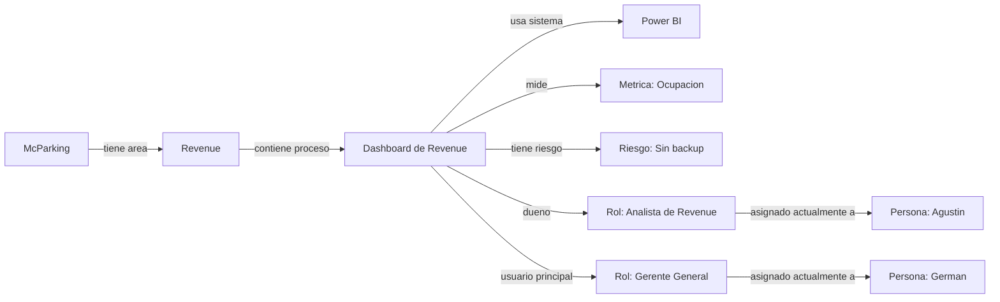

# Plan Maestro: Procesos Asociados a Roles Funcionales

## 1. Principio Central

La plataforma debe estar disenada para que los procesos, subprocesos, controles, metricas y sistemas esten asociados principalmente a roles funcionales, no directamente a personas individuales.

Las personas siguen siendo relevantes, pero deben entenderse como la asignacion actual de un rol. Esta separacion permite que McParking escale, cambie personas, cree nuevos equipos o replique el modelo en nuevas sedes, ciudades o paises sin redisenar su arquitectura operacional.

La estructura base es:

```text
Empresa -> Area -> Proceso -> Subproceso -> Rol responsable -> Persona asignada actualmente
```

## 2. Logica de Relacion

Cada proceso debe indicar que rol lo posee, ejecuta, aprueba, usa, consulta o respalda. Luego, la plataforma debe resolver que persona ocupa actualmente ese rol.

Ejemplo:

| Elemento | Valor |
| --- | --- |
| Proceso | Revenue Management |
| Subproceso | Dashboard de Revenue |
| Rol dueno | Analista de Revenue |
| Rol usuario principal | Gerente General |
| Persona asignada como Analista de Revenue | Agustin |
| Persona asignada como Gerente General | German |

La plataforma debe permitir leer dos niveles distintos:

1. Que rol es responsable del proceso.
2. Que persona ocupa actualmente ese rol.

## 3. Diferencia Entre Rol y Persona

### Rol

Un rol representa una funcion estable dentro de la empresa. El rol debe mantenerse aunque cambie la persona que lo ocupa.

Ejemplos de roles:

- Analista de Revenue
- Gerente General
- Encargado de Finanzas
- Encargado de Operaciones
- Encargado de Atencion al Cliente
- Responsable de Tecnologia
- Analista de Control de Gestion
- Encargado de Conciliacion
- Supervisor de Transporte
- Encargado de Facturacion
- Gerente Comercial
- Directorio

Clasificaciones posibles:

- Corporativo
- Local
- Operativo
- Estrategico
- De control
- De ejecucion
- De aprobacion

### Persona

Una persona representa quien ocupa actualmente uno o mas roles.

Ejemplos de personas:

- Agustin
- German
- Jose Luis
- Romario
- Hernan

Reglas principales:

- Una persona puede ocupar varios roles.
- Un rol puede tener una persona principal.
- Un rol puede tener una persona backup.
- Los procesos no deben depender estructuralmente de una persona, sino del rol que esa persona ocupa.

Ejemplo de asignaciones actuales:

| Persona | Roles actuales |
| --- | --- |
| Agustin | Analista de Revenue, Control de Gestion, Banco de Reservas |
| German | Gerente General |
| Romario | Tecnologia / Desarrollo |
| Hernan | Finanzas / Administracion |
| Jose Luis | Operaciones |

## 4. Procesos y Subprocesos

Los procesos representan lo que la empresa hace. Cada proceso puede tener subprocesos asociados, y cada subproceso debe conectarse a roles funcionales antes de conectarse a personas.

Ejemplos de procesos:

- Revenue Management
- Banco de Reservas
- Banco de Packs
- Conciliacion Transbank
- Facturacion
- Atencion al Cliente
- Operacion de Estacionamiento
- Transporte
- Tecnologia
- Finanzas

Ejemplo:

| Proceso | Subprocesos |
| --- | --- |
| Revenue Management | Dashboard de Revenue |
| Revenue Management | Seguimiento de ocupacion |
| Revenue Management | Analisis de descuentos |
| Revenue Management | Revision de precios |
| Revenue Management | Reporte a gerencia |

## 5. Ejemplo Practico: Dashboard de Revenue

### Objetivo

Asegurar que la empresa tenga informacion actualizada para analizar ingresos, ocupacion, precios, descuentos, reservas y comportamiento comercial.

### Roles involucrados

| Tipo | Rol |
| --- | --- |
| Dueno | Analista de Revenue |
| Usuario principal | Gerente General |
| Consultado | Operaciones |
| Informado | Directorio |

### Personas asignadas actualmente

| Rol | Persona actual |
| --- | --- |
| Analista de Revenue | Agustin |
| Gerente General | German |
| Operaciones | Responsable operativo actual |
| Directorio | Socios / Directorio |

Lectura correcta:

El Dashboard de Revenue no le pertenece a Agustin como persona. Le pertenece al rol Analista de Revenue. Hoy ese rol lo ocupa Agustin.

El dashboard le sirve principalmente al rol Gerente General. Hoy ese rol lo ocupa German.

## 6. Matriz de Responsabilidad Ajustada

La matriz debe separar roles de personas para evitar que el modelo organizacional quede amarrado a nombres individuales.

La matriz es una vista de usuario. En la base de datos no conviene guardar una fila plana con proceso, rol y persona como si fueran una sola entidad. Lo correcto es guardar las relaciones por separado y generar esta matriz desde vistas o consultas.

Campos sugeridos:

| Campo | Descripcion |
| --- | --- |
| Proceso | Proceso principal |
| Subproceso | Unidad operacional especifica |
| Rol responsable | Rol que responde por el resultado |
| Persona actual | Persona que hoy ocupa el rol responsable |
| Rol usuario | Rol que usa la salida del proceso |
| Persona usuaria | Persona que hoy ocupa el rol usuario |
| Rol aprobador | Rol que aprueba decisiones o resultados |
| Persona aprobadora | Persona que hoy ocupa el rol aprobador |
| Backup del rol | Rol o persona que cubre continuidad |
| Sistema | Herramientas o plataformas utilizadas |
| Criticidad | Nivel de impacto operacional |

Ejemplo:

| Campo | Valor |
| --- | --- |
| Proceso | Revenue Management |
| Subproceso | Dashboard de Revenue |
| Rol responsable | Analista de Revenue |
| Persona actual | Agustin |
| Rol usuario | Gerente General |
| Persona usuaria | German |
| Rol aprobador | Gerente General |
| Persona aprobadora | German |
| Backup del rol | No definido |
| Sistema | Power BI / Supabase / Banco de Reservas |
| Criticidad | Alta |

## 7. Impacto en el Grafico Nodal

El grafico nodal debe visualizar nodos de distintos tipos:

- Empresa
- Area
- Proceso
- Subproceso
- Rol
- Persona
- Sistema
- Metrica
- Control
- Riesgo

### Procesos

- Reservas McParking
- Conciliacion Transbank
- Dashboard de Revenue
- Banco de Reservas
- Banco de Packs
- Atencion al Cliente

### Roles

- Analista de Revenue
- Gerente General
- Encargado de Finanzas
- Responsable de Tecnologia
- Encargado de Operaciones

### Personas

- Agustin
- German
- Romario
- Jose Luis
- Hernan

Lectura visual esperada:

```text
Dashboard de Revenue
  -> pertenece a: Analista de Revenue
  -> actualmente asignado a: Agustin
  -> sirve a: Gerente General
  -> actualmente asignado a: German
```

Relaciones nodales minimas:



Relaciones esperadas:

```text
McParking -> tiene area -> Revenue
Revenue -> contiene proceso -> Revenue Management
Revenue Management -> contiene subproceso -> Dashboard de Revenue
Dashboard de Revenue -> pertenece a rol -> Analista de Revenue
Analista de Revenue -> ocupado por persona -> Agustin
Dashboard de Revenue -> sirve a rol -> Gerente General
Gerente General -> ocupado por persona -> German
Dashboard de Revenue -> usa sistema -> Power BI
Dashboard de Revenue -> mide metrica -> Ocupacion
Dashboard de Revenue -> tiene criticidad -> Alta
```

## 8. Beneficio para Escalabilidad

Este cambio transforma la plataforma desde una empresa dependiente de personas hacia una empresa ordenada por funciones.

Permite responder preguntas como:

- Que procesos dependen del rol Analista de Revenue.
- Que persona ocupa actualmente ese rol.
- Que roles no tienen backup.
- Que personas concentran demasiados roles.
- Que ocurre si una persona sale de la empresa.
- Que roles deben contratarse antes de crecer.
- Que roles debe tener una nueva sede.
- Que procesos pueden replicarse en otro pais.
- Que roles son corporativos y cuales son locales.

## 9. Tablas Necesarias en Base de Datos

La base de datos debe separar entidades y relaciones. La matriz final se debe construir como vista de consulta, no como tabla principal.

### companies

Representa empresas o unidades del grupo.

Campos sugeridos:

| Campo | Descripcion |
| --- | --- |
| id | Identificador unico |
| name | Nombre de la empresa o unidad |
| country_id | Pais principal |
| status | Estado |

Ejemplos:

- McParking
- Estacionamiento Aeropuerto
- El Alba
- Futuras empresas, paises o sedes

### areas

Representa areas funcionales.

Campos sugeridos:

| Campo | Descripcion |
| --- | --- |
| id | Identificador unico |
| company_id | Empresa asociada |
| name | Nombre del area |
| description | Descripcion funcional |
| status | Estado |

Ejemplos:

- Revenue
- Operaciones
- Finanzas
- Tecnologia
- Comercial
- Atencion al Cliente
- Direccion

### processes

Representa procesos principales.

Campos sugeridos:

| Campo | Descripcion |
| --- | --- |
| id | Identificador unico |
| company_id | Empresa asociada |
| area_id | Area asociada |
| name | Nombre del proceso |
| description | Descripcion del proceso |
| criticality | Criticidad |
| status | Estado |
| is_replicable | Indica si puede replicarse |
| is_global | Indica si es global o corporativo |
| documentation_status | Estado de documentacion |

### subprocesses

Representa subprocesos asociados a un proceso.

Campos sugeridos:

| Campo | Descripcion |
| --- | --- |
| id | Identificador unico |
| process_id | Proceso principal |
| name | Nombre del subproceso |
| description | Descripcion |
| frequency | Frecuencia |
| criticality | Criticidad |
| status | Estado |

### roles

Representa cargos o funciones de la empresa.

Campos sugeridos:

| Campo | Descripcion |
| --- | --- |
| id | Identificador unico |
| name | Nombre del rol |
| description | Descripcion funcional |
| area_id | Area asociada |
| level | Nivel organizacional |
| is_corporate | Indica si el rol es corporativo |
| is_local | Indica si el rol es local |
| status | Estado del rol |

Ejemplos:

- Analista de Revenue
- Gerente General
- Encargado de Finanzas
- Encargado de Operaciones
- Responsable de Tecnologia

### people

Representa personas reales.

Campos sugeridos:

| Campo | Descripcion |
| --- | --- |
| id | Identificador unico |
| name | Nombre de la persona |
| email | Correo |
| phone | Telefono |
| status | Estado |

Ejemplos:

- Agustin
- German
- Jose Luis
- Romario
- Hernan

### person_roles

Relaciona personas con roles.

Campos sugeridos:

| Campo | Descripcion |
| --- | --- |
| id | Identificador unico |
| person_id | Persona asignada |
| role_id | Rol ocupado |
| company_id | Empresa |
| country_id | Pais |
| site_id | Sede |
| is_primary | Indica si es asignacion principal |
| is_backup | Indica si es asignacion de respaldo |
| start_date | Fecha de inicio |
| end_date | Fecha de termino |
| status | Estado de la asignacion |

Ejemplo:

```text
Agustin -> Analista de Revenue
Agustin -> Responsable Banco de Reservas
Agustin -> Control de Gestion
```

Ejemplo tabular:

| Persona | Rol | Principal | Backup |
| --- | --- | --- | --- |
| Agustin | Analista de Revenue | Si | No |
| German | Gerente General | Si | No |
| Romario | Responsable de Tecnologia | Si | No |
| Hernan | Encargado de Finanzas | Si | No |

### process_roles

Relaciona procesos y subprocesos con roles.

Campos sugeridos:

| Campo | Descripcion |
| --- | --- |
| id | Identificador unico |
| process_id | Proceso |
| subprocess_id | Subproceso, si aplica |
| role_id | Rol relacionado |
| responsibility_type | Tipo de responsabilidad |
| impact_percent | Peso estimado en el proceso |
| criticality | Criticidad de la relacion |
| is_required | Indica si el rol es obligatorio |
| notes | Observaciones |

Tipos de responsabilidad:

- dueno
- responsable
- ejecutor
- aprobador
- usuario
- consultado
- informado
- backup

Ejemplo:

```text
Dashboard de Revenue -> Rol dueno: Analista de Revenue
Dashboard de Revenue -> Rol usuario: Gerente General
Dashboard de Revenue -> Rol informado: Directorio
```

### systems

Representa herramientas o plataformas usadas por procesos y roles.

Campos sugeridos:

| Campo | Descripcion |
| --- | --- |
| id | Identificador unico |
| name | Nombre del sistema |
| description | Descripcion |
| owner_role_id | Rol dueno del sistema |
| status | Estado |

### risks

Representa riesgos asociados a procesos, roles o sistemas.

Campos sugeridos:

| Campo | Descripcion |
| --- | --- |
| id | Identificador unico |
| process_id | Proceso asociado, si aplica |
| subprocess_id | Subproceso asociado, si aplica |
| role_id | Rol asociado, si aplica |
| system_id | Sistema asociado, si aplica |
| name | Nombre del riesgo |
| severity | Severidad |
| status | Estado |

### controls

Representa controles asociados a procesos, roles, riesgos o sistemas.

Campos sugeridos:

| Campo | Descripcion |
| --- | --- |
| id | Identificador unico |
| process_id | Proceso asociado |
| risk_id | Riesgo controlado |
| owner_role_id | Rol responsable del control |
| name | Nombre del control |
| frequency | Frecuencia |
| status | Estado |

### metrics

Representa metricas operacionales o de gestion.

Campos sugeridos:

| Campo | Descripcion |
| --- | --- |
| id | Identificador unico |
| process_id | Proceso asociado |
| subprocess_id | Subproceso asociado, si aplica |
| owner_role_id | Rol responsable |
| name | Nombre de la metrica |
| unit | Unidad de medida |
| frequency | Frecuencia |
| status | Estado |

## 10. Calculo de Cuellos de Botella

La plataforma debe calcular cuellos de botella en dos niveles distintos.

### Cuello de botella por rol

Evalua si una funcion concentra demasiados procesos criticos.

Ejemplo:

El rol Analista de Revenue concentra demasiados procesos criticos. Esto indica que la funcion esta sobrecargada, aun antes de analizar que persona ocupa el rol.

Indicadores sugeridos:

- Cantidad de procesos asociados al rol.
- Cantidad de procesos criticos asociados al rol.
- Criticidad acumulada.
- Cantidad de sistemas que debe manejar.
- Cantidad de responsabilidades como dueno o aprobador.
- Ausencia de backup.
- Si es rol corporativo o local.
- Si es necesario para expansion.

### Cuello de botella por persona

Evalua si una persona concentra demasiados roles o responsabilidades criticas.

Ejemplo:

Agustin ocupa varios roles criticos. Esto indica que la persona esta concentrando demasiada responsabilidad operativa.

Indicadores sugeridos:

- Cantidad de roles activos por persona.
- Cantidad de roles primarios.
- Cantidad de procesos criticos asociados indirectamente.
- Criticidad acumulada por persona.
- Cantidad de backups cubiertos.
- Cantidad de sistemas requeridos.
- Riesgo de concentracion.
- Riesgo si la persona sale.

### Brecha de backup

Evalua procesos o roles que tienen responsable definido, pero no cuentan con respaldo.

Ejemplo:

El proceso Banco de Reservas tiene rol responsable definido, pero no tiene backup asignado. Esto indica riesgo operativo.

### Brecha de contratacion

Evalua los roles necesarios para crecer a nuevas sedes, ciudades o paises.

Ejemplo:

Para expandirse a otra sede, el modelo requiere al menos estos roles locales: Encargado de Operaciones, Supervisor de Transporte, Atencion al Cliente y Encargado Administrativo.

### Indicadores por proceso

- Tiene rol dueno definido.
- Tiene persona asignada.
- Tiene backup.
- Tiene sistema asociado.
- Tiene documentacion.
- Tiene controles.
- Tiene metricas.
- Tiene riesgos identificados.

## 11. Vistas de la Plataforma

### Vista por Proceso

Debe mostrar:

- Proceso.
- Subprocesos.
- Roles responsables.
- Personas asignadas actualmente.
- Sistemas.
- Riesgos.
- Controles.
- Backups.

Ejemplo:

| Tipo | Rol | Persona actual |
| --- | --- | --- |
| Dueno | Analista de Revenue | Agustin |
| Usuario principal | Gerente General | German |
| Consultado | Operaciones | Jose Luis / responsable actual |
| Informado | Directorio | Socios / Directorio |
| Backup | No definido | No definido |

### Vista por Rol

Debe mostrar:

- Procesos asociados al rol.
- Criticidad acumulada del rol.
- Persona que ocupa el rol actualmente.
- Backup del rol.
- Sistemas que debe manejar.
- Tareas recurrentes.
- Riesgos asociados.

### Vista por Persona

Debe mostrar:

- Roles que ocupa la persona.
- Procesos donde participa.
- Carga total estimada.
- Criticidad acumulada.
- Backups que cubre.
- Riesgos por concentracion.

### Vista de Brechas Organizacionales

Debe mostrar:

- Roles sin persona asignada.
- Roles sin backup.
- Procesos sin rol dueno.
- Roles sobrecargados.
- Personas con demasiados roles criticos.
- Procesos criticos sin documentacion.
- Roles necesarios para expansion.

## 12. Alcance del MVP

Para partir simple, el MVP debe considerar estas entidades:

- Empresas
- Areas
- Procesos
- Subprocesos
- Roles
- Personas
- Relacion persona-rol
- Relacion proceso-rol
- Sistemas
- Riesgos y controles basicos

Con estas entidades, la plataforma ya puede entregar:

- Matriz de responsabilidades.
- Vista por proceso.
- Vista por rol.
- Vista por persona.
- Grafico nodal.
- Deteccion basica de cuellos de botella.
- Deteccion de roles sin backup.
- Deteccion de procesos sin dueno.
- Deteccion de personas sobrecargadas.

## 13. Decision de Diseno

La plataforma no debe preguntarse primero:

```text
Que hace Agustin?
```

Debe preguntarse:

```text
Que roles necesita la empresa para operar bien?
Que procesos dependen de cada rol?
Quien ocupa hoy esos roles?
Que pasa si esa persona ya no esta?
Que roles faltan para escalar?
```

Este cambio transforma la herramienta desde una lista de tareas y personas hacia una plataforma de gobierno operativo y estructura organizacional escalable.

## 14. Reglas de Implementacion

Para mantener el modelo consistente, la plataforma debe aplicar estas reglas:

1. Todo proceso critico debe tener al menos un rol dueno.
2. Todo rol dueno de un proceso critico debe tener persona principal asignada o quedar marcado como brecha.
3. Todo proceso critico debe tener backup definido o quedar marcado como riesgo.
4. Las relaciones proceso-persona deben resolverse a traves de roles, no como vinculos directos permanentes.
5. Una persona puede ocupar multiples roles, pero la plataforma debe calcular la concentracion de riesgo.
6. Los roles deben poder clasificarse como corporativos, locales o mixtos.
7. El modelo debe permitir replicar roles y procesos en nuevas sedes sin copiar personas.
8. Todo proceso, subproceso, sistema, metrica, control y riesgo debe estar asociado primero a un rol funcional.

## 15. Conclusion

El modelo debe construirse primero sobre roles y luego sobre personas.

La estructura correcta es:

```text
Proceso -> Rol requerido -> Persona asignada actualmente
```

Regla oficial del Plan Maestro:

```text
Todo proceso, subproceso, sistema, metrica, control y riesgo debe estar asociado primero a un rol funcional. La persona asignada representa unicamente la ocupacion actual de ese rol.
```

Esta arquitectura permite que McParking ordene su operacion, reduzca dependencia de personas especificas y prepare una estructura replicable para crecer a nuevas sedes, ciudades o paises.
